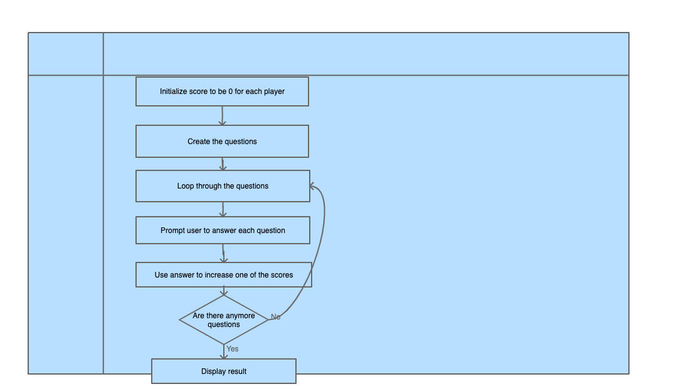
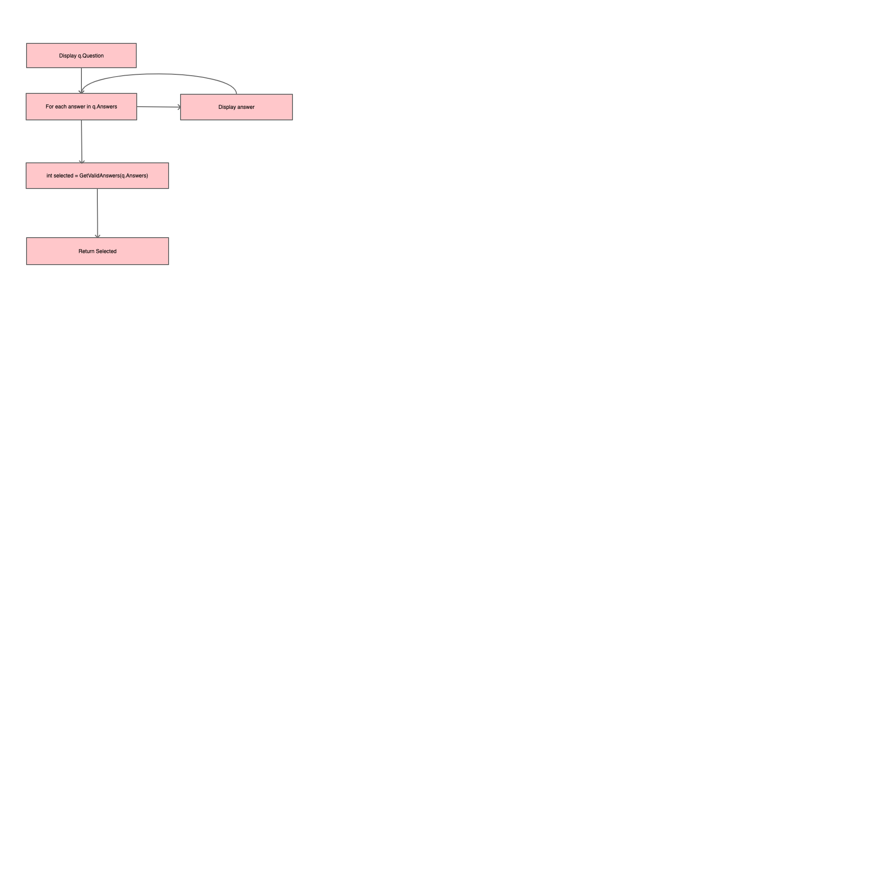
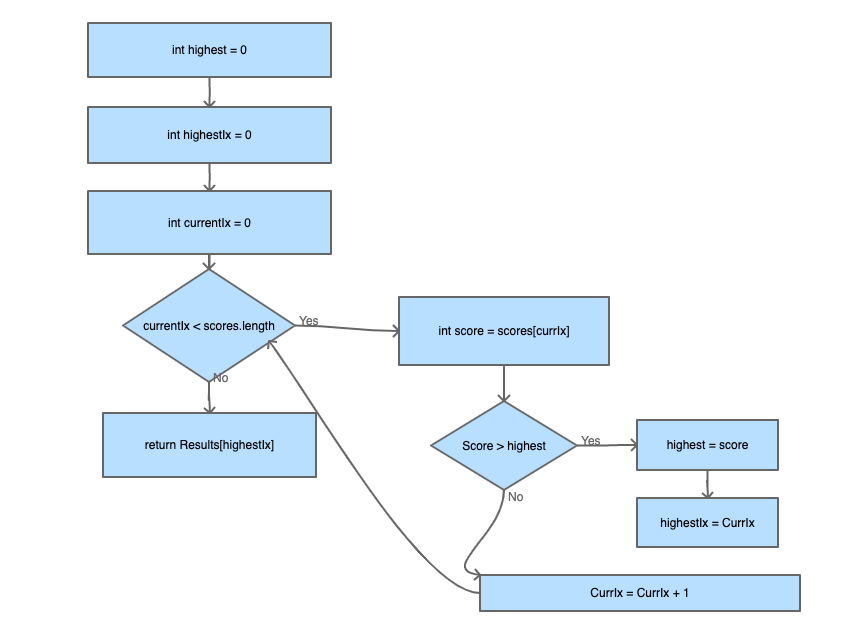

# DanielPersonalityQuiz

## Project Proposal Draft

Overview: In this project you will be taking a quiz to test what football player you are. There are a list of players and questions and your answer to each question will affect what player you are using a point system. The program will output the questions and accept user inputs using the keyboard. At the end of the quiz your player will be displayed on the screen.

Flowchart for Overview:

Methods:

static int AskQuestion(Question);

Descripition: This displays the question and all of the answers and prompts the user to choose one the answers and returns the answer.

static int GetValidAnswer(List<string> answers);

Descripition: Given a list of answers, prompts the user to enter a number corresponding to one of the answers. If the user enters a number that is not within the specified range, the user is asked to enter another value.

static string GetResult(List<int> scores, List<string> results);

Descripition: Given two lists, one representing the scores for each possible result and one representing each possible result, determines which score is the highest and returns the corresponding string from the results list.

### Variables

